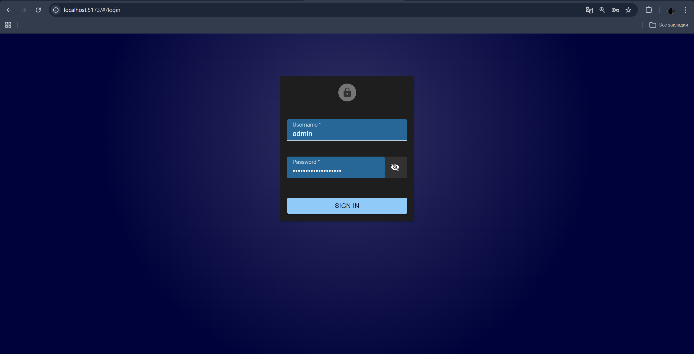
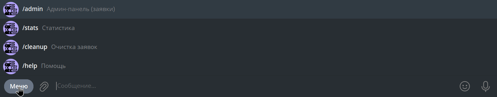

# 📚 Telegram Book Store Bot

Telegram-бот для книжного магазина с полноценной backend-архитектурой.  
Проект реализует приём заказов, работу с каталогом книг и административное управление через Telegram и API.

<p align="center">
    
</p>

Подходит для:
- небольших книжных магазинов
- Telegram-магазинов
- MVP интернет-магазина без отдельного сайта

---

## 🚀 Возможности

### 👤 Для пользователя
- Просмотр каталога книг
- Оформление заказа через Telegram
- Просмотр своих заказов и их статусов
- Удобный интерфейс без спама (редактирование сообщений)
- Предсказуемая логика заказов (1 активный заказ)

### 🛠 Для администратора
- Получение уведомлений о новых заказах
- Управление статусами заказов
- Админ-команды в Telegram
- Защита от «залипших» и повторных заказов
- Очистка и обслуживание базы данных

---

## 🖼 Примеры работы бота

### 📚 Каталог книг
Пользователь просматривает каталог книг прямо в Telegram с удобной навигацией и кнопками.

<p align="center">
  
  
  
</p>

---

### 🛒 Оформление заявки
Процесс оформления заявки без лишних шагов и спама — сообщения редактируются, интерфейс остаётся чистым.

<p align="center">
  
</p>

---

### 📦 Мои заказы
Пользователь может в любой момент посмотреть историю своих заказов и их текущий статус.

<p align="center">
    
</p>

---

### 🛠 Администрирование
Администратор получает уведомления о новых заказах и управляет их статусами напрямую через Telegram, может заходить в админ панель и использовать команды в телеграмм боте.

<p align="center">
    
    
    
</p>>

---

## 🧱 Архитектура проекта

Проект построен по принципам production-ready приложений:

- **Telegram Bot** — интерфейс взаимодействия с пользователем  
- **Backend (API)** — бизнес-логика и управление данными  
- **Database** — хранение книг, заказов и статусов  
- **Docker** — развёртывание и изоляция окружения

Такой подход позволяет:
- легко масштабировать проект
- подключать web-интерфейс или мобильное приложение
- использовать один backend для нескольких клиентов

---

## 🛠 Используемые технологии

- **Python 3.12**
- **aiogram 3.x** — Telegram Bot API
- **FastAPI** — backend и REST API
- **PostgreSQL** — база данных
- **SQLAlchemy** — ORM
- **Docker / docker-compose** — развёртывание
- **Pydantic** — схемы и валидация данных

---

## 📂 Структура проекта

```text
project-root/
├── bot/                # Telegram-бот (aiogram)
│   ├── handlers/
│   ├── keyboards/
│   ├── states/
│   └── main.py
│
├── backend/            # Backend (FastAPI)
│   ├── app/
│   │   ├── api/
│   │   ├── models/
│   │   ├── schemas/
│   │   ├── core/
│   │   └── main.py
│
├── docker-compose.yml
├── .env.example
└── README.md
```
---

## 💼 Адаптация проекта

Проект легко адаптируется под:

- магазины (книги, товары, услуги)

- приём заказов и заявок

- Telegram-магазины

- MVP стартапов

---

## 📄 Лицензия

Проект распространяется под лицензией **MIT**.

Вы можете свободно использовать, изменять и адаптировать данный проект под свои задачи, включая коммерческое использование.

Подробности см. в файле [`LICENSE`](LICENSE).
